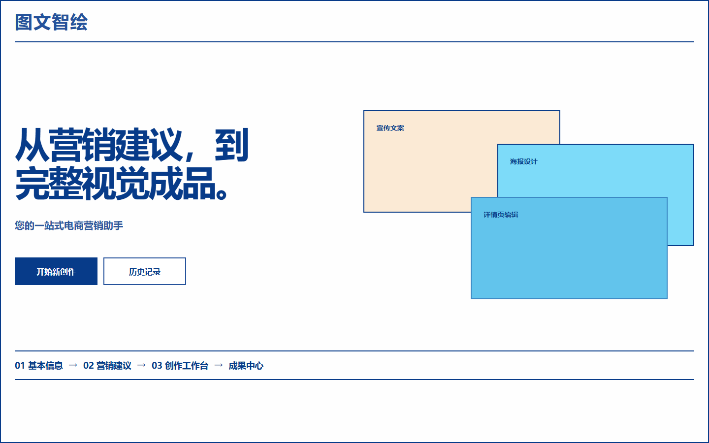
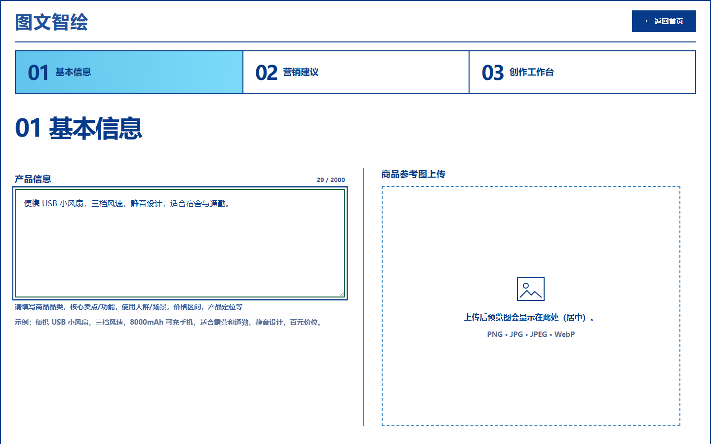
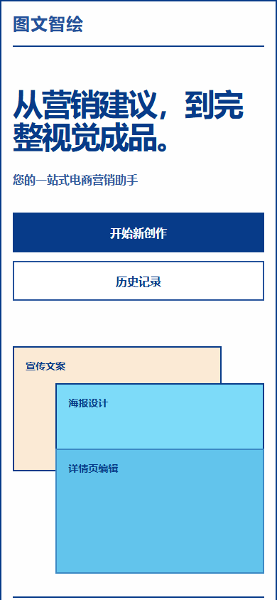
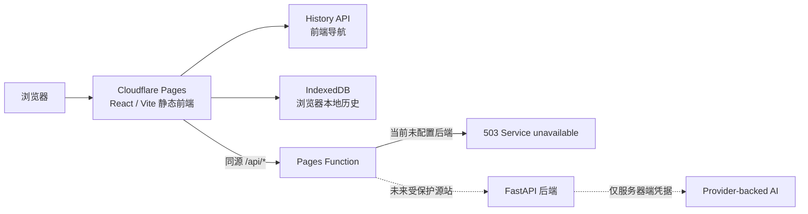

# 图文智绘（ArtLIVE-Front）

图文智绘是一套面向广告设计工作流的 React/Vite 前端：从商品基本信息出发，组织营销建议、推广文案、海报创作、海报编辑、详情页编辑、成果查看与本地历史记录等界面。当前公开版本是 **frontend-only preview**，重点展示 UI、导航、响应式布局、浏览器本地行为，以及已经验收的复古海洋视觉主题。

“图文智绘”是产品界面中保留的中文名称；“ArtLIVE-Front”是公开 GitHub 仓库及前端发布使用的项目名称。仓库名称不会替换或静默修改产品 UI 中的“图文智绘”。

> **English summary:** ArtLIVE-Front is a React/Vite frontend for an AI-assisted advertising design workflow. The current public release is a frontend-only preview; the FastAPI backend and provider-backed AI services are not publicly available yet.

## 在线演示

**Cloudflare Pages 公开地址：待首次部署成功并完成真实浏览器验收后补充。**

当前发布边界：

- React/Vite 前端源码已准备公开；
- FastAPI 后端未公开部署；
- Provider-backed AI 服务未公开提供；
- `/api/*` 当前没有公开后端源站，Pages Function 会安全失败关闭并返回通用 `503 Service unavailable`；
- 本预览不代表完整应用已经上线，也不代表系统已可用于生产环境。

## 界面截图

截图展示前端 UI、页面结构、响应式布局和复古海洋主题。它们由实际前端组件生成，不包含真实用户数据，也不表示后端或 AI 生成能力已经上线。

### 桌面端首页



### 桌面端工作流



### 移动端首页



## 功能与当前可用性

| 功能 | 公开预览状态 | 说明 |
|---|---|---|
| UI 与页面导航 | 可用 | 展示首页、工作流导航、路由保护、编辑界面和复古海洋主题。 |
| 响应式布局 | 可用 | 支持桌面与移动布局；README 截图视口为 1440 × 900 和 390 × 844。 |
| Browser History 路由 | 可用 | 前端实现规范路径、前进/后退、`popstate` 处理，以及不满足前置条件时的安全回退。 |
| IndexedDB 本地历史 | 浏览器本地可用 | 已实现确认成果的本地归档、读取、下载和删除；数据仅属于当前浏览器与设备，不是云同步或云持久化。由于公开后端不可用，公开预览不保证能够生成新的 AI 成果供归档。 |
| 本地前端编辑行为 | 可用或受前置状态限制 | 模板、背景、字体和编辑器交互属于前端实现；部分页面受工作流前置状态保护。 |
| FastAPI 后端 | 未公开部署 | 后端源码保留在 monorepo 中，但没有公开运行中的 FastAPI 服务。 |
| 营销建议生成 | 公开预览不可用 | 依赖未部署的后端与 Provider-backed 服务。 |
| AI 推广文案生成 | 公开预览不可用 | 依赖未部署的后端与 Provider-backed 服务。 |
| AI 海报与详情内容生成 | 公开预览不可用 | 生成、轮询、预览和下载 API 没有公开后端。 |
| rembg / 商品抠图 | 公开预览不可用 | 模型来源、供应和 Linux 公共运行环境尚未闭环。 |
| 云端持久化存储 | 未配置 | 没有持久磁盘、对象存储、跨设备同步或耐久任务队列。 |

## 工作流

当前前端表达的主要流程如下：

1. **首页与历史记录**：开始新会话、继续当前会话，或查看当前浏览器中的本地创作历史。
2. **基本信息**：填写商品说明，选择平台与风格，选择或上传商品图片。
3. **营销建议**：前端通过同源 `/api/v1/marketing-advice` 请求后端；当前公开预览没有后端，因此生成不可用。
4. **创作工作台**：在有效基本信息和营销建议基础上进入文案或海报工作流；路由会拒绝不满足前置条件的深链并回到安全入口。
5. **推广文案**：展示平台与风格相关的文案创作界面；AI 文案生成在公开预览中不可用。
6. **海报生成与编辑**：完整架构中由后端创建任务、轮询状态并返回 PNG/ZIP；前端包含模板选择、字体加载、画布编辑和确认流程，但公开预览不提供 AI 海报生成。
7. **详情页编辑**：包含 20 个详情背景，以及字体、文字、图形、图片层和本地画布编辑界面；rembg 与 AI 详情内容生成不可用。
8. **成果与本地历史**：满足一致性条件的确认成果可归档到 IndexedDB；记录不上传云端，清理浏览器站点数据后可能丢失。

```text
首页 / 本地历史
        │
        ▼
商品基本信息
        │
        ▼
营销建议（需要未公开后端）
        │
        ▼
创作工作台
   ┌────┴───────────┐
   ▼                ▼
推广文案        海报生成 → 海报编辑
                        │
                        ▼
                   详情页编辑
                        │
                        ▼
                  成果 / 本地历史
```

## 技术栈

| 层级 | 技术 |
|---|---|
| 前端框架 | React 19 |
| 语言 | TypeScript 6 |
| 构建工具 | Vite 8 |
| 样式 | 原生 CSS 与项目内语义主题 |
| 路由 | Browser History API 与项目内工作流路由守卫 |
| 浏览器本地数据 | IndexedDB |
| 前端测试 | Vitest、Testing Library、jsdom |
| 静态托管目标 | Cloudflare Pages |
| 边缘 API 边界 | Cloudflare Pages Functions |
| 可选后端架构 | FastAPI、Uvicorn、Python 3.10 |

## 架构



当前 frontend-only 预览只启用静态前端、浏览器导航、本地数据和 fail-closed Pages Function。虚线后的 FastAPI 与 Provider 服务没有公开部署。边缘代理共享秘密用于保护未来的后端源站，不等于终端用户认证。

## 仓库结构

仓库保持 monorepo 布局。Cloudflare Pages 只构建 `my_agent/frontend-react`，不会把整个仓库当作静态输出目录。

```text
.
├── README.md
├── docs/screenshots/readme/
│   ├── home-desktop.png
│   ├── workflow-desktop.png
│   └── home-mobile.png
├── my_agent/
│   ├── assets/
│   │   ├── detail_backgrounds/
│   │   └── poster_style_templates/
│   ├── backend/                         # FastAPI 源码，当前未公开部署
│   ├── fonts/                           # 本地应用字体副本
│   ├── frontend-react/
│   │   ├── functions/api/[[path]].js   # fail-closed Pages Function
│   │   ├── public/_routes.json
│   │   ├── public/fonts/poster-editor/
│   │   ├── src/
│   │   ├── package.json
│   │   └── vite.config.ts
│   ├── tests/
│   ├── .env.example                     # 仅脱敏空占位符
│   └── requirements-backend.txt
└── render.yaml                          # 未部署的后端蓝图
```

真实环境文件、模型、依赖目录、构建产物、运行时状态、用户上传、备份和内部验收证据不属于公开候选。

## 本地运行前端

使用仓库锁定的 `package-lock.json`：

```bash
cd my_agent/frontend-react
npm ci
npm run dev
```

Vite 会显示本地开发地址。开发服务器中的 `/api/*` 代理仅用于可选的本地后端开发，不是公开生产后端。查看纯前端静态界面不需要 Provider 密钥。

## 官方生产构建

```bash
cd my_agent/frontend-react
npm ci
npm run build
```

项目脚本原样执行：

```text
tsc -b && vite build
```

因此正式构建同时执行 TypeScript project build 和 Vite production build，输出目录为 `my_agent/frontend-react/dist`。仓库不提交 canonical `dist`；Cloudflare Pages 应从锁定依赖重新构建。

如需本地查看构建结果，可使用已有脚本：

```bash
npm run preview
```

## 可选的本地全栈关系

- React 前端始终使用同源相对 `/api/*` 请求。
- 本地 Vite 开发服务器可把 `/api` 代理到本机 8000 端口的 FastAPI。
- FastAPI ASGI 入口是 `my_agent.backend.main:app`。
- `render.yaml` 是未部署的后端蓝图，不是在线服务证明。
- 真实 Provider 凭据只能进入后端运行环境，不能进入 React/Vite 前端。
- rembg 模型、持久存储、任务耐久性和真实 Provider E2E 尚未完成公共部署验收。

如果目标只是查看公开前端演示，不需要启动 FastAPI，也不应配置任何 Provider 密钥。

## Cloudflare Pages 设置

| 设置 | 值 |
|---|---|
| Pages 项目名 | `artlive-front` |
| GitHub 仓库 | `ArtLIVE-Front` |
| Production branch | `main` |
| Monorepo root directory | `my_agent/frontend-react` |
| Framework preset | `Vite` |
| Build command | `npm run build` |
| Build output directory | `dist` |
| Node.js | `22.16.0` |
| Pages Functions directory | `functions` |
| Function routes | 使用 `public/_routes.json`，仅包含 `/api/*` |

Node.js `22.16.0` 是 Cloudflare Pages v3 build image 当前列出的默认 Node 版本，并满足当前 Vite 的 Node 22 兼容范围；仍须以本项目首次真实 Pages build 成功作为最终环境验收。

本次 frontend-only 预览不配置：

- `BACKEND_ORIGIN`；
- `BACKEND_PROXY_TOKEN`；
- Provider API key；
- 浏览器可见的后端共享秘密；
- 伪造或本地回环后端地址。

由于后端未部署，`/api/*` 会由现有 Pages Function 返回无内部细节的通用 `503 Service unavailable`。这是预期的失败关闭行为，不影响静态页面发布，也不表示 API 功能可用。

## 安全与环境变量

- 不要把 Provider 密钥、代理令牌或其他秘密写入前端源码、README、截图或提交历史。
- 不要把 Provider 密钥放入 `VITE_*` 变量；Vite 前端变量会进入浏览器可下载的生产包。
- 真实 `.env` 必须保持本地且不进入 Git；仓库只提交不含真实值的 `.env.example`。
- 当前 Pages 预览不需要 Provider 密钥，也不配置后端源站或内部代理令牌。
- 未来部署后端时，Provider 凭据只应存在于后端托管环境；Cloudflare 到 FastAPI 的共享边缘令牌也只能存在于服务器端绑定。
- 前端 API 使用同源 `/api/*`，不接受由浏览器选择任意后端目标。
- 不要在 issue、提交、截图或聊天中粘贴 token、部分 token、密钥指纹或带凭据 URL。
- 本公开预览不应处理或展示真实敏感用户数据。

这些规则用于缩小公开预览的攻击面，但不等同于独立安全认证或上线安全审计。

## 当前验证状态

当前接受基线仍保留 4 个历史测试失败，详见下表。

| 检查 | 结果 |
|---|---|
| TypeScript project build | PASS |
| 官方 `npm run build` | PASS |
| Vite production build | PASS，103 modules transformed |
| 完整前端 Vitest | 576 total；572 passed；4 个已接受历史失败 |
| 新增前端测试失败 | 0 |
| Unhandled test errors | 0 |
| Cloudflare proxy 合同测试 | 26/26 PASS，真实网络请求 0 |
| 完整 ESLint | 既有基线 5 errors / 1 warning；新增诊断 0 |
| 生产包已知真实秘密 / Provider key | 0 |
| 生产包 `fake-indexeddb` | 0 |
| 生产包 Windows 绝对路径 | 0 |
| canonical `dist` 非授权修改 | 0 |
| 真实 Cloudflare Pages build | 待首次部署验证 |
| 公开 URL 浏览器验收 | 待部署成功后执行 |
| 真实 Provider E2E | 未运行，超出 frontend-only 范围 |

四个已接受历史失败分别涉及：

1. Workflow V2 stable vocabulary 的旧 history 断言；
2. poster polling 404 的旧错误文案断言；
3. poster preview 404 的旧错误文案断言；
4. poster template 测试对 Vite 资源 URL 形态的旧耦合断言。

因此这里只说明 TypeScript 与正式生产构建已经通过本地验证，不声称所有测试或所有 lint 检查已经通过。

## 已知限制

- 当前仅发布 frontend-only public preview；后端与 AI 服务仍离线。
- FastAPI 后端没有公开地址。
- Provider-backed 营销建议、文案、海报和详情内容生成均不可用。
- rembg / cutout 不可用。
- `/api/*` 的通用 503 是后端缺席时的预期行为。
- 依赖后端结果的后续页面受工作流前置条件和路由守卫限制。
- IndexedDB 历史只保存在当前浏览器；清理站点数据、切换设备或浏览器不会自动同步。
- 没有云持久化、对象存储、持久磁盘、耐久任务队列或跨重启恢复保证。
- 截图中的 UI 状态不等于在线 AI 生成结果。
- 当前仍有 4 个已接受历史测试失败和既有 ESLint 诊断。
- rembg 模型的公共托管来源、文件级许可、供应链锁定和 Linux 运行验收尚未完成。
- `render.yaml` 的存在不表示后端已经部署。
- 完整应用仍处于公开部署准备阶段。

## 路线图

1. 完成 Cloudflare Pages 静态前端部署与真实桌面/移动浏览器验收；
2. 为 FastAPI 选择并验证受保护的公开托管方案；
3. 仅在服务器端配置 Provider 凭据，并加入预算、限流和滥用防护；
4. 解决 rembg 模型文件级来源、许可、校验值和 Linux 供应问题；
5. 为生成任务加入持久存储、耐久队列、生命周期和清理策略；
6. 处理现有历史测试与 ESLint 基线；
7. 执行 Cloudflare → FastAPI 的真实网络合同测试；
8. 在单独授权和预算边界下执行真实 Provider E2E；
9. 如计划允许第三方复制、修改或再分发，再单独选择并添加明确的软件许可证。

## 素材公开声明

本次公开范围内的 20 个 PNG 背景、3 个 SVG 模板、11 个字体内容及 `test_product.jpg`，已由项目所有者确认可用于本次公开发布。11 个字体在项目中各有本地应用副本和前端部署副本；两组 22 个物理字体文件逐字节相同。因此资产口径是 **35 项逻辑内容、46 个项目内物理路径**。

> Publication authorization confirmed by the project owner.

该确认是项目所有者作出的发布授权声明，不应被解释为独立版权审计、独立字体许可证审计、权利链鉴定，或认定素材采用某一特定第三方许可证。

## 许可证状态

本仓库当前计划公开可见，但尚未选择或授予开源许可证。公开可见不等于开源授权；在添加明确许可证之前，不应把本仓库称为 open source。

> This repository currently does not grant an open-source license. Unless explicitly stated otherwise, all rights are reserved.

当前不提供 LICENSE 文件或许可证徽章。
